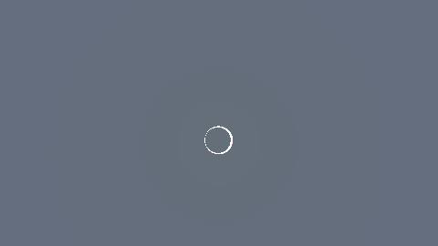
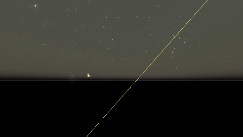

# stars

`stars` は Rust で書かれた、物理モデル寄りのクロスプラットフォーム星空レンダラーです。
目標は大きく2つあります。

- 気軽に使える星空ビューアとして、ユーザーが「いま何を見ているのか」を理解できること。
- 天文学・教育・研究用途でも説明可能なように、座標変換、時刻系、測光、大気モデルの選択が明示され、テストされていること。

英語版 README は [`README.md`](README.md) です。

## デモギャラリー

キュレーション済みシーン。各画像は再現可能なシーンプリセットです。
フルギャラリー: [`docs/demo-gallery.ja.md`](docs/demo-gallery.ja.md).

| 皆既日食 | Belt of Venus（反太陽方向、東京） | 木星のガリレオ衛星影 |
|---|---|---|
|  |  |  |
| `--preset solar-eclipse` | `--preset civil-twilight-antisolar-tokyo` | `--preset jupiter-shadow-transit` |

```bash
make demo-gallery   # docs/assets/demo-gallery/ にキュレーション済みセットを再生成
```

## 何ができるか

現在のエンジンには、以下が実装されています。

- 地平線、方位、水平座標グリッド、赤道座標グリッド、黄道、子午線、銀河座標、星座オーバーレイ。
- 星座線、IAU / Delporte 星座境界、明るい星・太陽/月/惑星・星座・方位・角度の文字ラベル。
- HDR レンダリング、星の物理ベースの明るさ・色、大気減光、グレア、明所視 / 薄明視 / 暗所視寄りの適応、拡散夜空光、黄道光、大気光、星間塵減光。
- UTC / UT1 / TAI / TT / 近似 TDB の時刻系。
- 固有運動、年周光行差、IAU 2006 歳差、簡易章動、大気差。
- 太陽、月、水星から海王星までの惑星、月相、統合食 / 掩蔽パイプライン
  （`V-51`。日食について実装済み: 月による太陽の解析マスク + Koomen 1952 の
  昼光減光 + Baumbach 1937 のコロナ）、昼光・薄明の空色。
- Web UI の観測計画機能、つまり出・南中・入り、薄明時間帯の表示。
- perspective に加えて Mollweide / Aitoff / Hammer の全天投影。
- 地球外の `galactic-north` / `custom-external` 視点による、IAU 銀河座標系パーセクスケールカメラからの局所的な天の川円盤表示。
- OTA と接眼レンズの組み合わせから倍率、プレートスケール、射出瞳、実視野を求める望遠鏡接眼レンズシミュレーション。
- CLI / desktop / web で共有できる schema-versioned JSON session と、短い共有向けの Web session URL。
- Web UI の英語 / 日本語バイリンガル対応。ブラウザ言語の自動判定、共有用 `?lang=en|ja` URL パラメータ、設定パネル内の言語スイッチャーを備えます。
- Web アプリのオブジェクト検索 / GoTo / 情報パネル (V-56)。検索ボックスから、
  固有名 / Bayer / Flamsteed / HR / HD / HIP で示される 1,200 より多い明るい恒星、
  Messier 110 天体、明るい NGC / IC 天体、太陽 ・ 月 ・ 惑星 7 個（「土星」など日本語名
  も受け付け）を表示順位付きで検索できます。選んだ天体にカメラをスラーし、赤経・
  赤緯、高度 ・ 方位、等級、距離、出・南中・入りを表示するインフォパネルを開きます。
- 決定的な validation / demo 用 scene preset、notebook 再現性 example、catalog backend scaling scaffold、任意実行の screenshot review 用 gallery。
- 引用用 metadata、Zenodo release archive 用 metadata、モデル選択を確認する standards-compliance page。

## CLI 生成ギャラリー

以下の README 画像は `apps/cli` が生成した決定的な PNG です。更新する場合は
`./scripts/generate-readme-images.sh` を実行します。

| 東京の夏の空 | Hammer 全天投影 | 銀河北極からの外部視点 |
|---|---|---|
|  |  |  |

実装済み機能の記録は [`PROGRESS.md`](PROGRESS.md)、今後の計画は [`ROADMAP.md`](ROADMAP.md) を見てください。

## すぐ試す

```bash
make setup
make viewer
```

CLI で PNG を出力する場合:

```bash
make cli ARGS="--lat 35.68 --lng 139.69 --azimuth 180 --altitude 30 -o stars.png"
```

portable JSON session を保存・再生する場合、または組み込み preset を描画する場合:

```bash
make cli ARGS="--lat 35.68 --lng 139.69 --write-session tokyo.json -o stars.png"
make cli ARGS="--session tokyo.json -o replay.png"
make cli ARGS="--preset dark-sky -o dark-sky.png"
```

Web 版を起動する場合:

```bash
make web
```

ヘッドレス HTTP サーバ (`L-22`) を起動する場合 (既定 `127.0.0.1:8787`):

```bash
make server
# 別ターミナルから
curl http://127.0.0.1:8787/healthz
curl http://127.0.0.1:8787/presets/tokyo-tonight \
  | curl -X POST --data-binary @- \
         -H 'Content-Type: application/json' \
         'http://127.0.0.1:8787/render?width=1280&height=720' \
         -o tokyo.png
```

ローカル CI 相当のチェック:

```bash
make ci
```

## リポジトリ構成

```txt
crates/astronomy   時刻系、座標変換、補正、天体暦、測光、大気、空の輝き、観測計画
crates/catalog     HYG カタログ読み込み、色変換、座標変換
crates/renderer    wgpu レンダラー、カメラ、オーバーレイ、トーンマップ、星インスタンス
crates/common      CLI / desktop viewer / server で共有する native host 共通処理
apps/cli           PNG を出力する headless renderer
apps/server        ヘッドレス HTTP host (axum)
apps/viewer        native desktop viewer
apps/web           WASM engine wrapper と frontend UI
scripts            カタログ取得・README 画像生成・WASM build helper
```

詳しい構造は [`ARCHITECTURE.md`](ARCHITECTURE.md) にあります。

## ドキュメント

- [`ROADMAP.md`](ROADMAP.md) — Visual / Library の 2 トラック計画、未実装項目、各項目の実装詳細と参照文献。
- [`PROGRESS.md`](PROGRESS.md) — 実装済み機能のログ。
- [`ARCHITECTURE.md`](ARCHITECTURE.md) — crate 境界、データフロー、座標系、renderer pipeline、host integration。
- [`CONTRIBUTING.md`](CONTRIBUTING.md) — セットアップ、チェック、PR 方針、数値変更時のルール。
- [`VALIDATION.md`](VALIDATION.md) — 科学的・数値的な検証方針と現在の限界。
- [`DATA_SOURCES.md`](DATA_SOURCES.md) — カタログ、星座データ、文献データの出典。
- [`CITATION.cff`](CITATION.cff) と [`docs/citation.md`](docs/citation.md) — 推奨 citation text、Zenodo release DOI workflow、data/source caveat。
- [`docs/standards-compliance.md`](docs/standards-compliance.md) — 実装済みの IAU/SOFA 系 routine、近似、non-goal。
- [`docs/scene-presets.md`](docs/scene-presets.md) — 決定的な named scene と JSON session export workflow。
- [`docs/validation-gallery.md`](docs/validation-gallery.md) — 生成式 demo gallery と任意実行の screenshot regression workflow。
- [`docs/catalog-backend-design.md`](docs/catalog-backend-design.md) — 大規模 catalog ingest 前の backend、identifier、LOD、paging、WASM subset 方針。
- [`examples/notebooks`](examples/notebooks) — JSON session の再生、固定された天文 table の比較、CLI rendering を行う Jupyter / Python example。

## 現在の開発フォーカス

作業は 2 つの直交トラックで管理されています（[`ROADMAP.md`](ROADMAP.md) 参照）：**V — Visual**（観測者が画面で見るもの）と **L — Library / platform**（数値エンジンと reach）。Visual の識別オーバーレイ (`V-01`–`V-12`)、暗夜空の物理パイプライン (`V-13`–`V-23`)、大気差と太陽/月/惑星描画 (`V-29`–`V-36`)、全天投影 (`V-40`)、地球外視点 (`V-41`, `V-44`)、望遠鏡接眼レンズ (`V-43`)、Messier + 明るい NGC / IC サブセットの deep-sky overlay (`V-42`) は実装済み。Library トラックは IAU 準拠の時間・譳動・章動・年周光行差・固有運動 (`L-01`–`L-05`)、観測計画ヘルパー (`L-07`, `L-08`)、シェア可能 JSON session、scene preset、validation gallery、citation metadata、standards-compliance ドキュメント、data provenance manifest を実装済み。

次に着手すべきは：

1. 裸眼で見えるのに未実装の暗夜空現象：大気分散 (`V-25`)、ビーナスベルト・地球影帯 (`V-27`)、分光的 airglow (`V-28`)—裸眼シンチレーション (`V-24`) と地球照 (`V-26`) は出荷済み。
2. 大気モデルの自己整合性：統一スペクトル消散 (`V-37`) と Hošek-Wilkie 昼間空 (`V-38`) は出荷済み、次は光害 / Bortle (`V-39`)。
3. accessibility (`L-24`)、観測計画 polish (`L-09`)、変光星 light curve (`L-20`)、`V-42` 組込み subset の上に乗せる runtime OpenNGC streaming backend (次の PR)。
4. Python bindings (`L-21`) と headless server mode (`L-22`)。
5. data provenance manifest (`data/manifest.toml`) が入ったので、大規模 Gaia / Tycho / Hipparcos ingest (`L-17`) と identifier preservation (`L-18`) も着手可能です。

## 開発に参加する場合

コードを変更する前に [`CONTRIBUTING.md`](CONTRIBUTING.md) を読んでください。
天文計算の数値出力に影響する変更では、必ず値を固定するテストを追加または更新してください。静かな数値ドリフトを CI で検出するためです。
