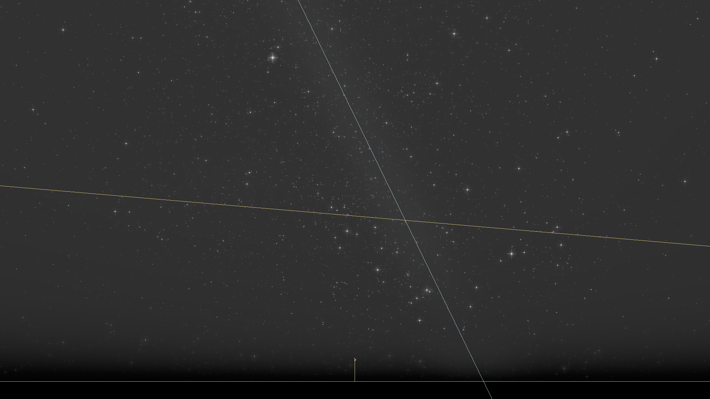
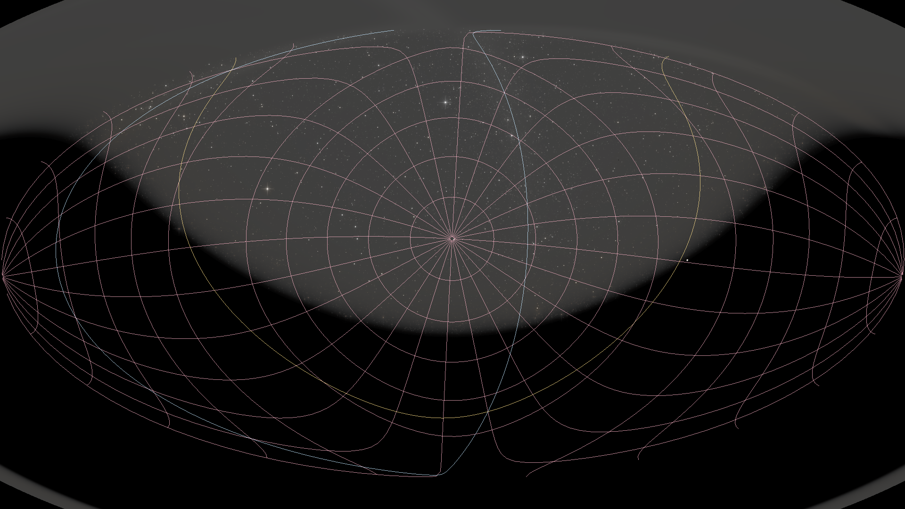
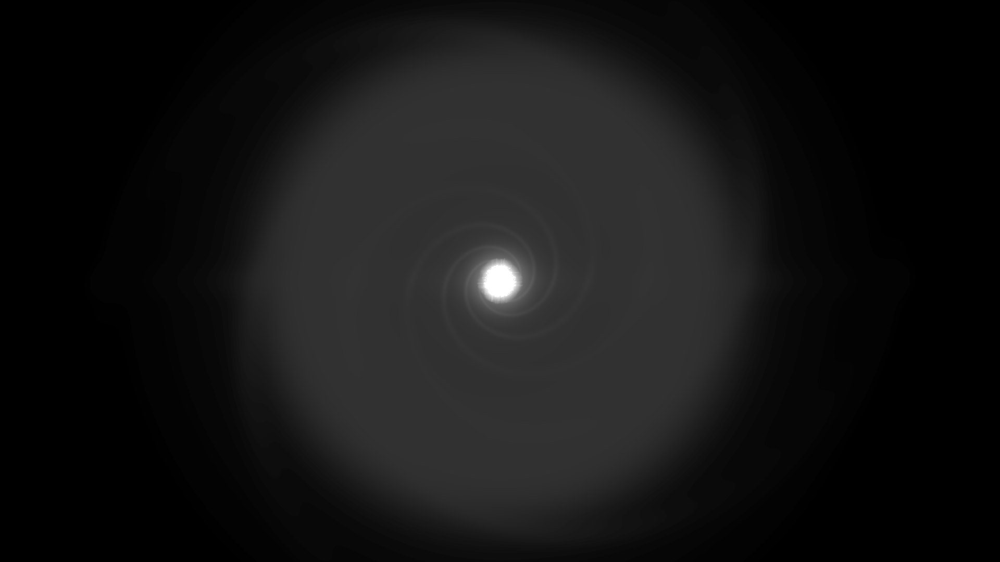

# stars

`stars` は Rust で書かれた、物理モデル寄りのクロスプラットフォーム星空レンダラーです。
目標は大きく2つあります。

- 気軽に使える星空ビューアとして、ユーザーが「いま何を見ているのか」を理解できること。
- 天文学・教育・研究用途でも説明可能なように、座標変換、時刻系、測光、大気モデルの選択が明示され、テストされていること。

英語版 README は [`README.md`](README.md) です。

## 何ができるか

現在のエンジンには、以下が実装されています。

- 地平線、方位、水平座標グリッド、赤道座標グリッド、黄道、子午線、銀河座標、星座オーバーレイ。
- 星座線、IAU / Delporte 星座境界、明るい星・太陽/月/惑星・星座・方位・角度の文字ラベル。
- HDR レンダリング、星の物理ベースの明るさ・色、大気減光、グレア、明所視 / 薄明視 / 暗所視寄りの適応、拡散夜空光、黄道光、大気光、星間塵減光。
- UTC / UT1 / TAI / TT / 近似 TDB の時刻系。
- 固有運動、年周光行差、IAU 2006 歳差、簡易章動、大気差。
- 太陽、月、水星から海王星までの惑星、月相 / 月食時の暗化補助、昼光・薄明の空色。
- Web UI の観測計画機能、つまり出・南中・入り、薄明時間帯の表示。
- perspective に加えて Mollweide / Aitoff / Hammer の全天投影。
- 地球外の `galactic-north` / `custom-external` 視点による、IAU 銀河座標系パーセクスケールカメラからの局所的な天の川円盤表示。
- OTA と接眼レンズの組み合わせから倍率、プレートスケール、射出瞳、実視野を求める望遠鏡接眼レンズシミュレーション。
- CLI / desktop / web で共有できる schema-versioned JSON session と、短い共有向けの Web session URL。
- 決定的な validation / demo 用 scene preset、notebook 再現性 example、任意実行の screenshot review 用 gallery。
- 引用用 metadata、Zenodo release archive 用 metadata、モデル選択を確認する standards-compliance page。

## CLI 生成ギャラリー

以下の README 画像は `apps/cli` が生成した決定的な PNG です。更新する場合は
`./scripts/generate-readme-images.sh` を実行します。

| 東京の夏の空 | Hammer 全天投影 | 銀河北極からの外部視点 |
|---|---|---|
|  |  |  |

実装済み機能の記録は [`PROGRESS.md`](PROGRESS.md)、今後の計画は [`ROADMAP.md`](ROADMAP.md) を見てください。

## すぐ試す

```bash
make setup
make viewer
```

CLI で PNG を出力する場合:

```bash
make cli ARGS="--lat 35.68 --lng 139.69 --azimuth 180 --altitude 30 -o stars.png"
```

portable JSON session を保存・再生する場合、または組み込み preset を描画する場合:

```bash
make cli ARGS="--lat 35.68 --lng 139.69 --write-session tokyo.json -o stars.png"
make cli ARGS="--session tokyo.json -o replay.png"
make cli ARGS="--preset dark-sky -o dark-sky.png"
```

Web 版を起動する場合:

```bash
make web
```

ローカル CI 相当のチェック:

```bash
make ci
```

## リポジトリ構成

```txt
crates/astronomy   時刻系、座標変換、補正、天体暦、測光、大気、空の輝き、観測計画
crates/catalog     HYG カタログ読み込み、色変換、座標変換
crates/renderer    wgpu レンダラー、カメラ、オーバーレイ、トーンマップ、星インスタンス
crates/common      CLI / desktop viewer 向けの native host 共通処理
apps/cli           PNG を出力する headless renderer
apps/viewer        native desktop viewer
apps/web           WASM engine wrapper と frontend UI
scripts            カタログ取得・README 画像生成・WASM build helper
```

詳しい構造は [`ARCHITECTURE.md`](ARCHITECTURE.md) にあります。

## ドキュメント

- [`ROADMAP.md`](ROADMAP.md) — フェーズ計画、未実装項目、完了条件。
- [`PROGRESS.md`](PROGRESS.md) — 実装済み機能のログ。
- [`ARCHITECTURE.md`](ARCHITECTURE.md) — crate 境界、データフロー、座標系、renderer pipeline、host integration。
- [`CONTRIBUTING.md`](CONTRIBUTING.md) — セットアップ、チェック、PR 方針、数値変更時のルール。
- [`VALIDATION.md`](VALIDATION.md) — 科学的・数値的な検証方針と現在の限界。
- [`DATA_SOURCES.md`](DATA_SOURCES.md) — カタログ、星座データ、文献データの出典。
- [`CITATION.cff`](CITATION.cff) と [`docs/citation.md`](docs/citation.md) — 推奨 citation text、Zenodo release DOI workflow、data/source caveat。
- [`docs/standards-compliance.md`](docs/standards-compliance.md) — 実装済みの IAU/SOFA 系 routine、近似、non-goal。
- [`docs/scene-presets.md`](docs/scene-presets.md) — 決定的な named scene と JSON session export workflow。
- [`docs/validation-gallery.md`](docs/validation-gallery.md) — 生成式 demo gallery と任意実行の screenshot regression workflow。
- [`examples/notebooks`](examples/notebooks) — JSON session の再生、固定された天文 table の比較、CLI rendering を行う Jupyter / Python example。

## 現在の開発フォーカス

Phase 1、Phase 1'、Phase 2、citation / standards documentation、notebook 再現性 example、Phase 4 の全天投影、Phase 4 の地球外・銀河視点、そして Phase 4 の望遠鏡接眼レンズシミュレーションは実装済みです。次は、残りの platform 基盤を固めつつ、見た目と UX を小さく拡張していくのが自然です。

1. Gaia / Tycho / Hipparcos ingest の前に、catalog backend のスケーリング設計。
2. Messier / NGC などの deep-sky overlay。
3. accessibility、観測計画機能の polish、変光星 light curve。
4. Phase 3 platform 向けの Python bindings と headless server mode。

## 開発に参加する場合

コードを変更する前に [`CONTRIBUTING.md`](CONTRIBUTING.md) を読んでください。
天文計算の数値出力に影響する変更では、必ず値を固定するテストを追加または更新してください。静かな数値ドリフトを CI で検出するためです。
