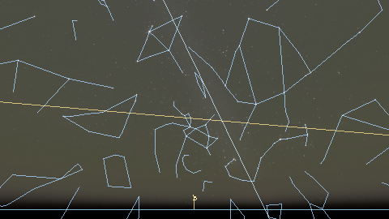
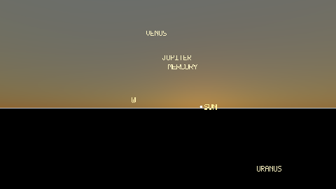
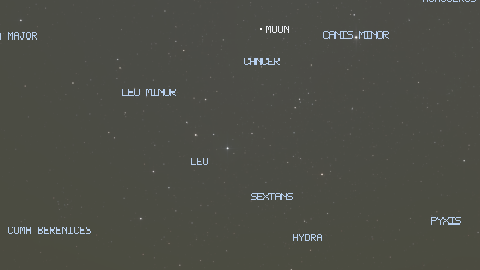
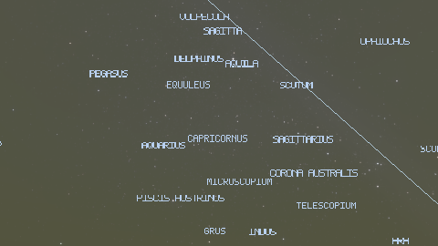
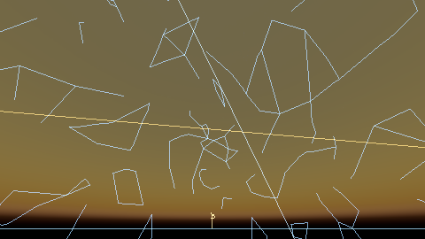
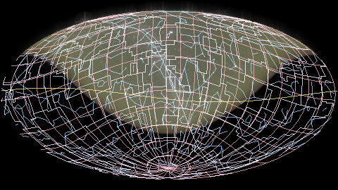

# Demo gallery

A curated tour of `stars` — a physically-grounded sky renderer covering
naked-eye through small-telescope phenomena. Every scene below is a
deterministic, reproducible session: clone the repo, run the command,
get the same pixels.

The full set of presets (including the technical baselines used for
visual regression) lives in [`validation-gallery.md`](validation-gallery.md);
this page is the curated front-door subset of the most visually-striking
scenes.

## Reproduce any scene

```bash
cargo run -p stars-cli --release -- --preset <name> -o out.png
```

Re-render the whole curated set:

```bash
make demo-gallery
```

The committed PNGs are 480 × 270 (the same resolution used by
`docs/assets/validation`). Override via `STARS_DEMO_GALLERY_WIDTH` /
`STARS_DEMO_GALLERY_HEIGHT` when invoking the script directly.

## Curated scenes

### 🌆 Tokyo tonight



The default local perspective: 35.68° N, 139.69° E, 2026-06-21 evening,
all overlays on. The entry point most users see first — stars at
catalogue colour through B−V → blackbody → sRGB (V-23), Kasten-Young
extinction (V-37), planet labels, horizon and ecliptic.

Preset: `tokyo-tonight`

---

### 🌅 Sunset horizon



Golden-hour scattering: Preetham analytic sun-lit sky (V-32) blending
into horizon haze. Low-solar-altitude continuity all the way down to the
civil-twilight band.

Preset: `sunset`

---

### 🌄 Belt of Venus (anti-solar Tokyo)


The pink Belt-of-Venus arch and the blue-grey Earth-shadow band beneath
it, seen looking opposite the Sun during civil twilight (V-27). Fit to
the Lee & Hernández-Andrés 2003 anti-twilight measurements.

Preset: `civil-twilight-antisolar-tokyo`

---

### 🌙 Moonlit night



Lambertian-shaded Moon disk with a per-channel earthshine ("Da Vinci
glow", V-26) added to the unlit hemisphere, plus the moonlit additive
sky term. Lunar illuminance follows Krisciunas-Schaefer 1991.

Preset: `moonlit-night`

---

### 🌌 Dark sky — Milky Way



High-altitude rural night: Leinert 1998 integrated star light, zodiacal
light, three-component spectral airglow (V-28: O I 557.7 nm green,
Na D 589 nm yellow, OH Meinel red/IR), and SFD dust attenuation through
the Milky Way band.

Preset: `dark-sky`

---

### 🏙️ Light pollution comparison (Bortle 1 vs Bortle 8)

| Bortle 1 (rural) | Bortle 8 (city sky) |
|---|---|
|  |  |

V-39 Bortle / SQM observer-side light-pollution scaling: same renderer,
same date, same coordinates. Bortle 8 layers the warm-orange
sodium / LED tint over a Garstang horizon-brightening kernel, dimming
faint stars through the same Kasten-Young extinction the natural sky
uses.

Presets: `dark-sky-bortle-1`, `tokyo-bortle-8`

---

### ☀️ Total solar eclipse


The V-51c unified eclipse / occultation pipeline: analytic Moon-on-Sun
subtract mask, Koomen 1952 daylight darkening (sky luminance scaled by
the obscured solar flux), and a Baumbach 1937 corona during totality.

Preset: `solar-eclipse`

---

### 🪐 Venus transit of the Sun


V-51e planet-on-Sun transit: Venus's apparent disk enters the analytic
occluder array (V-51b) as a small dark spot inside the Sun, daylight-band
sky unchanged outside the disk.

Preset: `venus-transit`

---

### 🌖 Galilean shadow on Jupiter


V-52d: a Sun-projected Galilean-moon position emits a small
Planet(Jupiter)-targeted occluder; the moon sprite itself is culled when
it sits behind Jupiter. Pinned to the 2008-12-20 Io shadow ingress
against JPL Horizons.

Preset: `jupiter-shadow-transit`

---

### 🗺️ Full-sky Mollweide



Equal-area Mollweide projection of the full celestial sphere (V-40):
Milky Way band, dust attenuation, and the coordinate grid across the
±180° azimuth wrap.

Preset: `all-sky-mollweide`

---

### 🌐 Galactic-north viewpoint


External viewpoint looking down the galactic north pole (V-41): HYG
catalogue distances drive a distance-scaled star field around an
analytic Milky Way disk. The same camera-uniform pipeline used for
Earth-side scenes — only the viewpoint origin changes.

Preset: `galactic-north`

## Provenance

Every PNG above is tracked in [`data/manifest.toml`](../data/manifest.toml)
with `kind = "generated"` and `preprocessing = "scripts/render-demo-gallery.sh"`.
`make manifest-check` (part of `make ci`) re-hashes the committed bytes
and fails on silent drift.

Scene-preset session JSONs live under `docs/presets/sessions/`. The
catalogue, ephemeris, and atmosphere versions are part of each session
file, so any future re-render reproduces the same scientific state.
