# Validation / demo gallery

The validation gallery is generated from the deterministic scene presets in
[`scene-presets.md`](scene-presets.md). It gives reviewers a human-readable
before/after surface for renderer changes and provides an opt-in screenshot
regression check for environments where the wgpu adapter is pinned.

Generate or refresh the gallery PNGs:

```bash
./scripts/render-validation-gallery.sh --update
```

Run exact byte-for-byte screenshot regression against committed gallery PNGs:

```bash
./scripts/render-validation-gallery.sh --check
```

`--check` is deliberately not part of default `make ci`: image readback can vary
by GPU/driver. The committed gallery baseline is 480×270 by default. CI jobs
with a fixed software adapter may call the script and can adjust
`STARS_VALIDATION_WIDTH` / `STARS_VALIDATION_HEIGHT` when regenerating their own
baseline set.

## Gallery index

When generated, PNGs live under `docs/assets/validation/`.

| Preset | Preview | Review focus |
|---|---|---|
| `tokyo-tonight` | 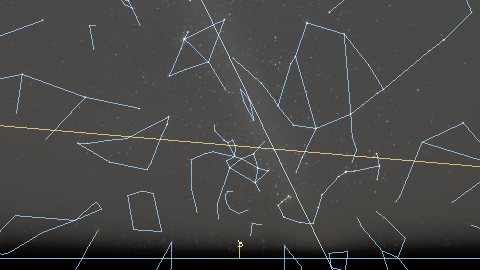 | Default local perspective, overlays, labels, star/planet composition. |
| `dark-sky` | 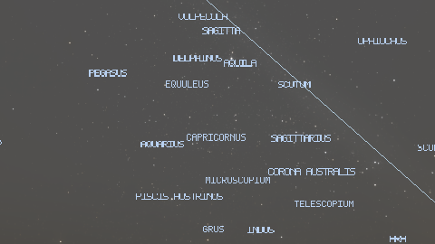 | Dark-sky glow, extinction, Milky Way band, high-altitude atmosphere. |
| `noon` | 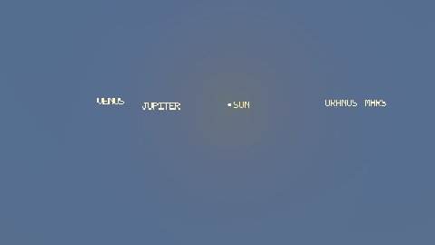 | Daylight scattering, solar disk, star suppression by sky radiance. |
| `sunset` | 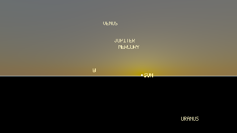 | Golden-hour colour, horizon haze, low-solar-altitude continuity. |
| `civil-twilight` | 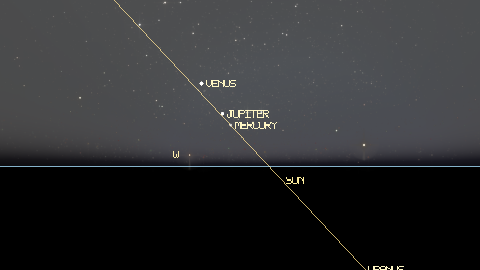 | Civil twilight band and day/night blend. |
| `nautical-twilight` | 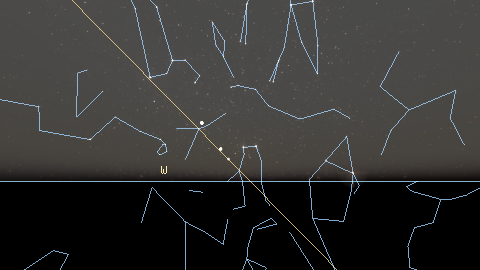 | Nautical twilight band and additive dark-sky transition. |
| `astronomical-twilight` | 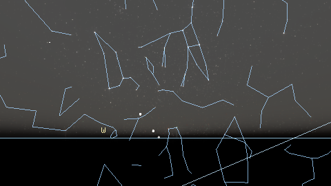 | Astronomical twilight boundary and dark-sky continuity. |
| `moonlit-night` | 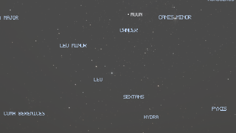 | Moon disk, lunar illuminance, and moonlit sky term. |
| `eclipse-aid` | 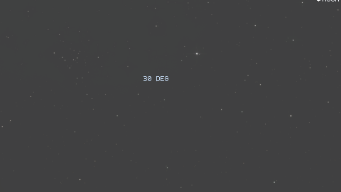 | Moon phase and Earth-shadow aid path. |
| `solar-eclipse` |  | V-51c solar-eclipse pipeline: analytic Moon-on-Sun mask, Koomen 1952 daylight darkening, Baumbach 1937 corona. |
| `venus-transit` | 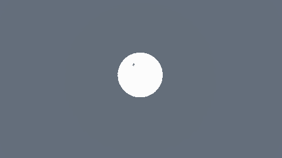 | V-51e planet-on-Sun pipeline: planet apparent disk as analytic mask inside the solar disk, daylight-band sky unchanged outside the disk. |
| `all-sky-hammer` | 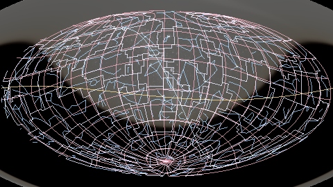 | Hammer projection and full-sky overlay clipping. |
| `all-sky-mollweide` | 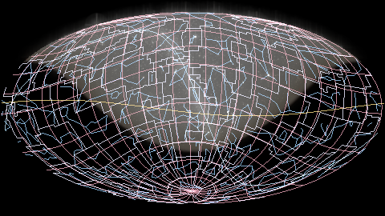 | Equal-area map and Milky Way / coordinate-grid continuity. |
| `galactic-north` | 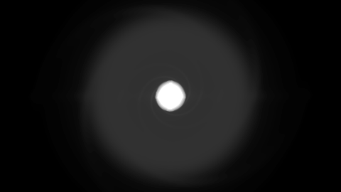 | External viewpoint, HYG distances, analytic Milky Way disk. |
| `custom-external` | 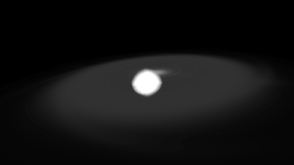 | Custom external camera serialization and orientation. |

## Review policy

For renderer-visible changes, regenerate the gallery locally, inspect the PNGs,
and either commit accepted baseline changes or describe the before/after in the
PR. For numerical astronomy changes that alter object placement, keep the usual
pinned model/unit tests in addition to any screenshot review.
